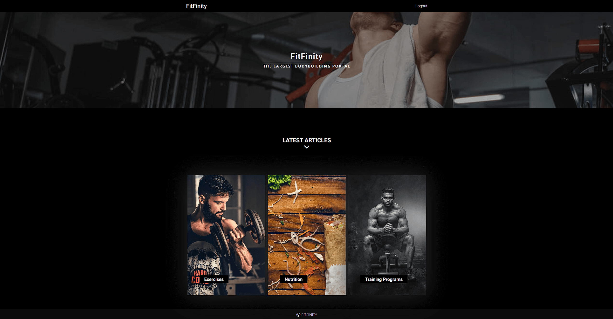
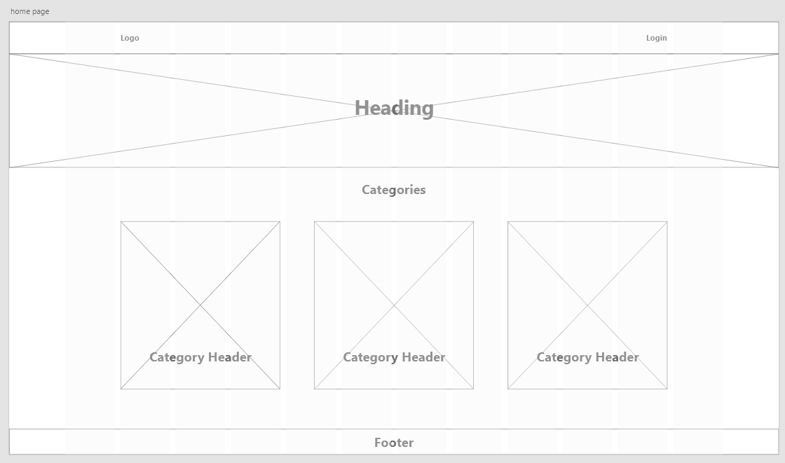
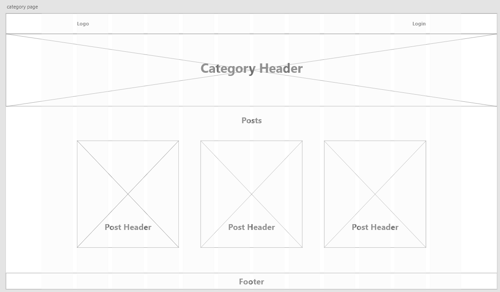
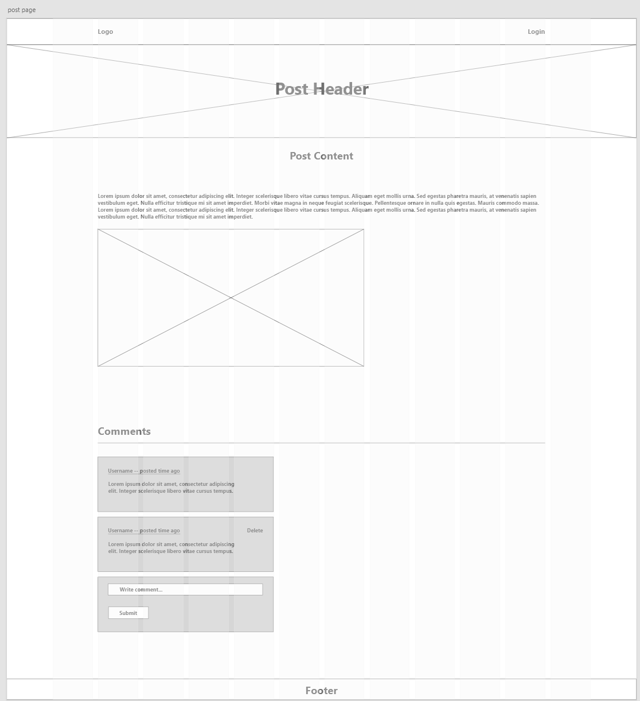
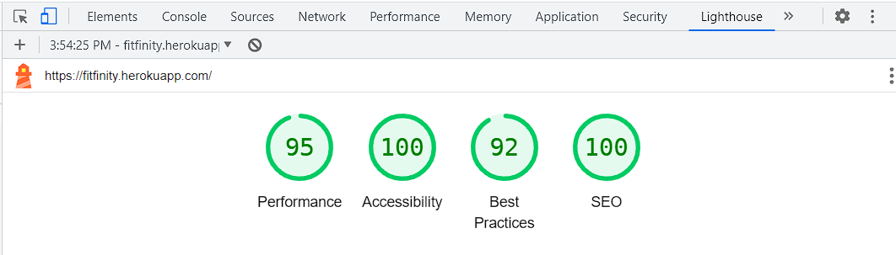
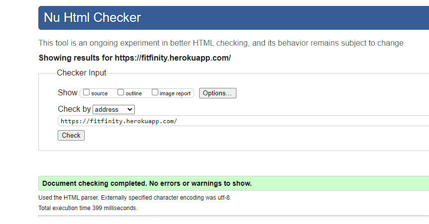
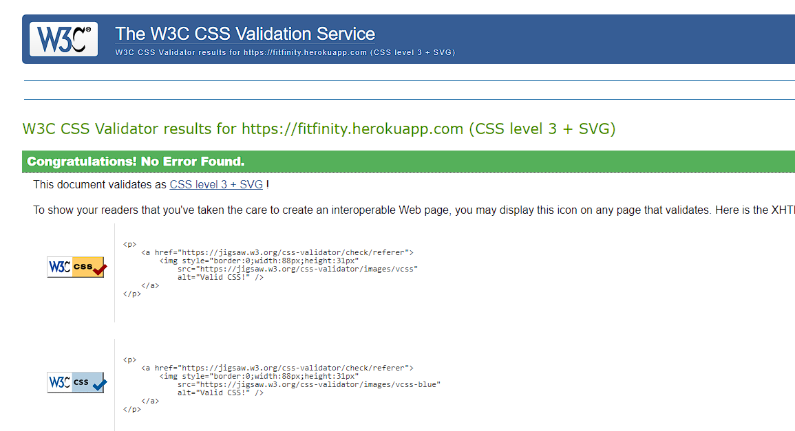

# FitFinity | PORTFOLIO PROJECT 4
FitFinity is the fourth Project for Code Institute. The website is designed to be responsive, allowing visitors to view and interact with the website on different type and size of devices. The purpose of FitFinity website is to serve as an online platform that provides informative and engaging content related to bodybuilding, fitness, nutrition, and overall wellness. It aims to educate, inspire, and empower individuals who are interested in bodybuilding or seeking to improve their physical strength and physique.

[View live website here.](https://fitfinity.herokuapp.com/)

## Table of Contents
___

- [User Experience (UX)](#user-experience)
    - [User stories](#user-stories)
    - [Features](#features)
    - [Structure](#structure)
        - [Home Page](#home)
        - [Category Page](#category)
        - [Post page](#post)
        - [Delete Page](#delete)
    - [Structure](#structure)
    - [Design](#design)
        - [Typography](#typography)
        - [Colour Scheme](#color)
        - [Imagery](#imagery)
    - [Wireframes](#wireframes)
- [Teschnologies](#technologies)
    - [Languages Used](#languages)
    - [Frameworks, Libraries & Programs Used](#flp)
- [Testing](#testing)
    - [Lighthouse](#lighthouse)
    - [HTML Validation](#html-validation)
    - [CSS Validation](#css-validation)
- [Deployment](#deployment)
    - [Version Controle](#version-controle)
    - [Heroku](#heroku)
- [Credits](#credits)
    - [Media](#media)
    - [Content](#content)
    - [Other](#other)
- [Acknowledgements](#acknowledgements)

## User Experience (UX)
___

### User Stories

 
<ul>
    <li>As a Site User I can register an account so that I can comment and like</li>
    <li>As a Site User I can view a list of posts so that I can select one to read</li>
    <li>As a Site User I can click on a post so that I can read the full text</li>
    <li>As a Site User I can view comments on an individual post so that I can read the conversation</li>
    <li>As a Site User I can leave comments on a post so that I can be involved in the conversation</li>
</ul>
 

### Features

 
 

>As a Site User I can register an account so that I can comment and like.

<ul>
    <li>Nav bar will provide a link to register button and login button for already registed users.</li>
</ul>
 

>As a Site User I can view a list of posts so that I can select one to read.

<ul>
    <li>Home page provide the user with catogories of post they would like to see.</li>
    <li>Each category contains a list of posts related to category.</li>
</ul>
 

>As a Site User I can click on a post so that I can read the full text.

<ul>
    <li>Each post card image is clickable and will open related post.</li>
</ul>
 

>As a Site User I can view comments on an individual post so that I can read the conversation.

<ul>
    <li>Each blog post has comments displaying at the bottom of the post.</li>
</ul>
 

>As a Site User I can leave comments on a post so that I can be involved in the conversation.

<ul>
    <li>If the user loges in he or she will be able to leave a comment on the post using the form at the bottom of the post in the comments section.</li>
</ul>
 

### Structure

 
    <ul>
    <li id="home">Home page
        <ul>
            <li>Navigation menu that is responsive on all devices and screen sizes and provides login, register, logout links.</li>
            <li>Header with the name of the organisation and its ethos.</li>
            <li>A section with categories.</li>
        </ul>
    </li>
    <li id="category">Category Page
        <ul>
            <li>Navigation menu that is responsive on all devices and screen sizes and provides login, register, logout links.</li>
            <li>Hero image with the image of the category and its heading.</li>
            <li>A section with posts.</li>
        </ul>
    </li>
    <li id="post">Post Page
        <ul>
            <li>Navigation menu that is responsive on all devices and screen sizes and provides login, register, logout links.</li>
            <li>Hero image with the image of the post and its heading.</li>
            <li>Blog post body that contains the content of the post.</li>
            <li>Commnets section that display all the comments for related blog post.</li>
            <li>Commnets form that allows loged in users to leave a comment.</li>
        </ul>
    </li>
    <li id="delete">Delete Page
        <ul>
            <li>Contains a form confimation for deleting a comment with a button to confirm and a link to send the user back to previous page.</li>
        </ul>
    </li>
 

### Design

 
<ul>
    <li id="typography">Typography
    <ul>
        <li>Roboto was user for all the heading and Open Sans for all other elements. Sans-Serif as a fallback font if for any reason the main font would not load.</li>
    </ul>
    </li>
    <li id="color">Colour Scheme
    <ul>
        <li>Three colours were used for this website which is black, white smoke and orange for: 
            <ul>
                <li>Minimalistic and Elegant Design</li>
                <li>Timeless and Classic Appeal</li>
                <li>Visual Contrast and Emphasis</li>
            </ul>
        </li>
    </ul>
    </li>
    <li id="imagery"> Imagery
    <ul>
        <li>All images in each section of the website are designed to catch the user's attention. Images have been taken for this project from <a href="https://www.pexels.com/">pexels.com</a>.</li>
    </ul>
    </li>
</ul>

## Wireframes
___

### Home Page

 

### Category Page

 

### Post Page

 

## Technologies
___

### Languages Used

 
<ul>
    <li><a href="https://en.wikipedia.org/wiki/HTML">HTML5</a></li>
    <li><a href="https://en.wikipedia.org/wiki/CSS">CSS3</a></li>
    <li><a href="https://en.wikipedia.org/wiki/Django_(web_framework)">Python Django Framework</a></li>
</ul>
 

### Frameworks, Libraries & Programs Used

 
<ul>
    <li><a href="https://fonts.google.com/">Google Fonts</a>
        <ul>
            <li>Google fonts were used to import the 'Roboto' and 'Open Sans' fonts into the style.css file.</li>
        </ul>
    </li>
</ul>
<ul>
    <li><a href="https://fontawesome.com/">Font Awesome</a>
        <ul>
            <li>Font Awesome was used for icons.</li>
        </ul>
    </li>
</ul>
<ul>
    <li><a href="https://git-scm.com/">Git</a>
        <ul>
            <li>Git was used for version control by utilizing the Gitpod terminal to commit to Git and Push to GitHub.</li>
        </ul>
    </li>
</ul>
<ul>
    <li><a href="https://github.com/">GitHub</a>
        <ul>
            <li>GitHub was used to store the projects code after being pushed from Git.</li>
        </ul>
    </li>
</ul>
<ul>
    <li><a href="https://www.adobe.com/uk/products/xd.html">Adobe XD</a>
        <ul>
            <li>Adobe XD was used to create wireframes.</li>
        </ul>
    </li>
</ul>
<ul>
    <li><a href="https://www.gitpod.io/">Gitpod</a>
        <ul>
            <li>Gitpod was used to develop the website.</li>
        </ul>
    </li>
</ul>
<ul>
    <li><a href="https://dashboard.heroku.com/apps">Heroku</a>
        <ul>
            <li>Heroku was used to Deploy Application.</li>
        </ul>
    </li>
</ul>

## Testing
___

### Lighthouse

### HTML Validation

### CSS Validation

## Deployment
___

### Version Controle

The website was developed in the Visual Studio Code editor and then uploaded to the remote "fitfinity" repository on Github.

Throughout the course of development, the following git commands were used to push code to the remote repository:

<ul>
    <li><mark>git add .</mark> To stage changes before committing.</li>
    <li><mark>git commit -m "commit message"</mark> To commit changes.</li>
    <li><mark>git push</mark> Push committed changes to repository.</li>
    <li><mark>git reset --hard</mark> To update current branch to the specified commit, unstage any changes and delete any changes from working directory.</li>
</ul>
 

### Heroku

<ol>
    <li>Log into Heroku</li>
    <li>Click "New"</li>
    <li>Click "Create new app"</li>
    <li>Give app a name and select the region</li>
    <li>Click "Create app"</li>
    <li>Navigate to Settings</li>
    <li>Add Config Vars</li>
    <li>Navigate to Deploy</li>
    <li>Choose deployment method as github</li>
    <li>Click "Deploy Branch"</li>
</ol>
 

## Credits
___

<ul>
    <li id="media">Media
        <ul>
            <li>All images were taken from <a href="https://www.pexels.com/">pexels.com</a> and <a href="https://www.google.ie/">google</a>.</li>
        </ul>
    </li>
</ul>
 
<ul>
    <li id="content">Content
        <ul>
            <li>The content was taken from <a href="https://www.kulturizmas.net/">kulturizmas.net</a> and translated to english using <a href="https://www.google.com/search?q=google+transle&rlz=1C1FHFK_enIE942IE942&oq=goo&aqs=chrome.0.69i59j69i57j69i59l2j35i39i650j46i67i131i199i433i465i650j0i131i433i512j0i433i512l2j0i271.1083j0j15&sourceid=chrome&ie=UTF-8">google translate</a></li>
        </ul>
    </li>
</ul>
 
<ul>
    <li id="other">Other
        <ul>
            <li>Code Institute walk trough projects.</li>
            <li><a href="https://www.youtube.com/watch?v=PtQiiknWUcI&t=7561s">Traversi Media</a> Python Django 7 Hour Course by Dennis Ivy</li>
        </ul>
    </li>
</ul>

### Acknowledgements

<ul>
    <li>A big thanks to my Mentor Ronan for valuable feedback.</li>
    <li>Also would like to thank Code Institute Tutor Suport for helping me on when I was stuck.</li>
</ul>